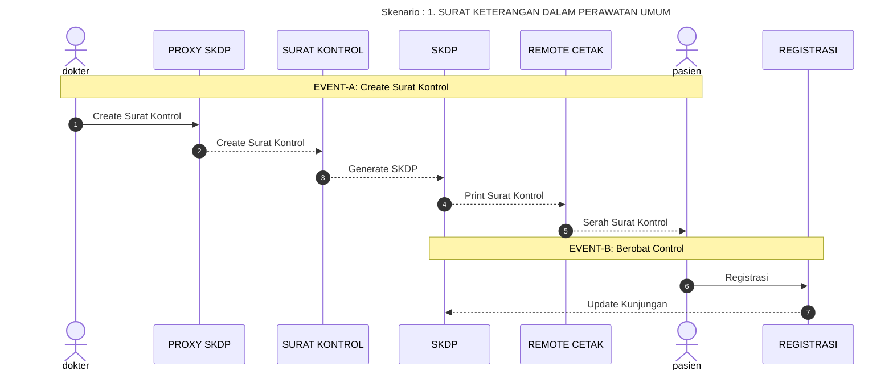
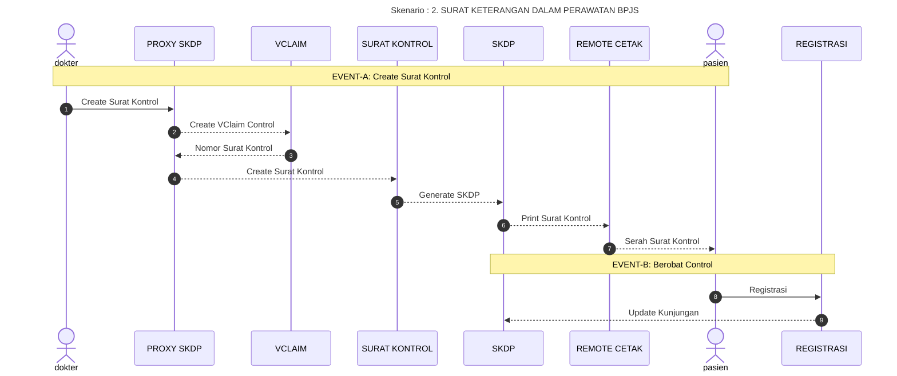
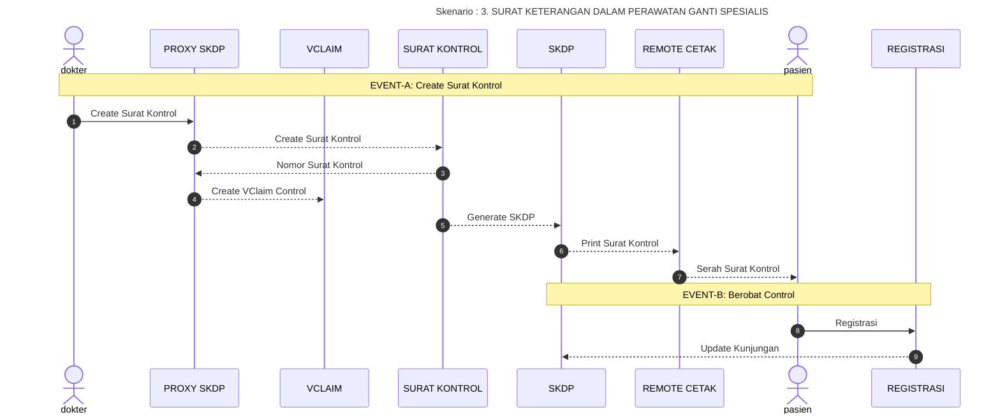
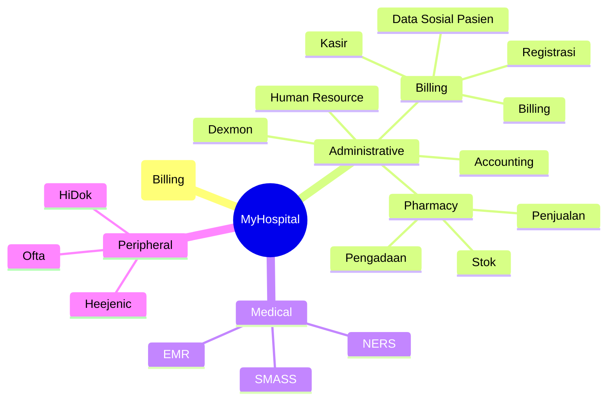
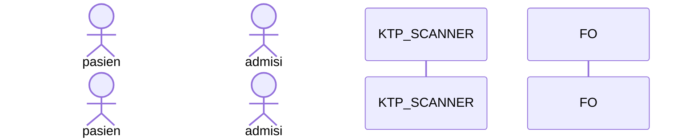

```mermaid
    sequenceDiagram
    title Skenario : 1. SURAT KETERANGAN DALAM PERAWATAN UMUM
    
    actor dokter
    participant PROXY SKDP
    participant SURAT KONTROL
    participant SKDP
    participant REMOTE CETAK
    actor pasien
    participant REGISTRASI
    autonumber

    note over dokter, pasien: EVENT-A: Create Surat Kontrol
    dokter ->> PROXY SKDP: Create Surat Kontrol
    PROXY SKDP -->> SURAT KONTROL: Create Surat Kontrol
    SURAT KONTROL -->> SKDP: Generate SKDP
    SKDP -->> REMOTE CETAK: Print Surat Kontrol
    REMOTE CETAK -->> pasien: Serah Surat Kontrol
    
    note over SKDP, REGISTRASI: EVENT-B: Berobat Control
    pasien ->> REGISTRASI: Registrasi
    REGISTRASI -->> SKDP: Update Kunjungan
```

```mermaid
    sequenceDiagram
    title Skenario : 2. SURAT KETERANGAN DALAM PERAWATAN BPJS

    actor dokter
    participant PROXY SKDP
    participant VCLAIM
    participant SURAT KONTROL
    participant SKDP
    participant REMOTE CETAK
    actor pasien
    participant REGISTRASI
    autonumber

    note over dokter, pasien: EVENT-A: Create Surat Kontrol
    dokter ->> PROXY SKDP: Create Surat Kontrol
    PROXY SKDP -->> VCLAIM : Create VClaim Control
    VCLAIM -->> PROXY SKDP : Nomor Surat Kontrol
    PROXY SKDP -->> SURAT KONTROL: Create Surat Kontrol
    SURAT KONTROL -->> SKDP: Generate SKDP
    SKDP -->> REMOTE CETAK: Print Surat Kontrol
    REMOTE CETAK -->> pasien: Serah Surat Kontrol

    note over SKDP, REGISTRASI: EVENT-B: Berobat Control
    pasien ->> REGISTRASI: Registrasi
    REGISTRASI -->> SKDP: Update Kunjungan
```

```mermaid
    sequenceDiagram
    title Skenario : 3. SURAT KETERANGAN DALAM PERAWATAN GANTI SPESIALIS

    actor dokter
    participant PROXY SKDP
    participant VCLAIM
    participant SURAT KONTROL
    participant SKDP
    participant REMOTE CETAK
    actor pasien
    participant REGISTRASI
    autonumber

    note over dokter, pasien: EVENT-A: Create Surat Kontrol
    dokter ->> PROXY SKDP: Create Surat Kontrol
    PROXY SKDP -->> SURAT KONTROL: Create Surat Kontrol
    SURAT KONTROL -->> PROXY SKDP : Nomor Surat Kontrol
    PROXY SKDP -->> VCLAIM : Create VClaim Control
    SURAT KONTROL -->> SKDP: Generate SKDP
    SKDP -->> REMOTE CETAK: Print Surat Kontrol
    REMOTE CETAK -->> pasien: Serah Surat Kontrol

    note over SKDP, REGISTRASI: EVENT-B: Berobat Control
    pasien ->> REGISTRASI: Registrasi
    REGISTRASI -->> SKDP: Update Kunjungan
```

```mermaid
    mindmap
    root((MyHospital))
        (Billing)
        Administrative
            Billing
                Data Sosial Pasien
                Registrasi
                Billing
                Kasir
            Pharmacy
                Pengadaan
                Penjualan
                Stok
            Accounting
            Human Resource
            Dexmon
        Medical
            EMR
            SMASS
            NERS
        Peripheral
            HiDok
            Heejenic
            Ofta
```

```mermaid
    sequenceDiagram
        actor pasien
        actor admisi
        participant KTP_SCANNER
        participant FO
```