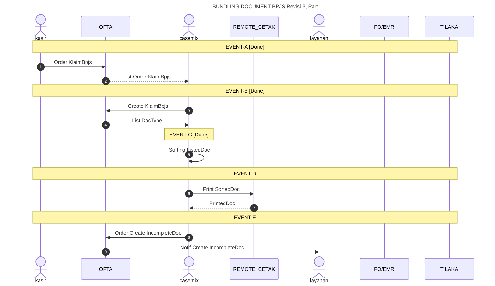
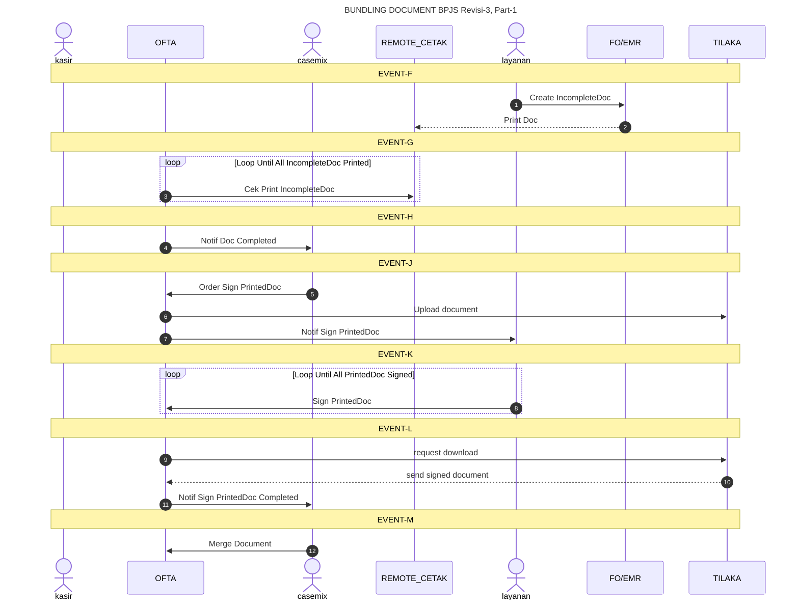

```mermaid
sequenceDiagram
    title BUNDLING DOCUMENT BPJS Revisi-3, Part-1
    actor kasir
    participant OFTA
    actor casemix
    participant REMOTE_CETAK
    actor layanan
    participant FO/EMR
    participant TILAKA
    autonumber 1

    note over kasir, TILAKA: EVENT-A [Done]
    kasir ->> OFTA: Order KlaimBpjs 
    OFTA -->> casemix: List Order KlaimBpjs 

    note over kasir, TILAKA: EVENT-B [Done]
    casemix ->> OFTA: Create KlaimBpjs
    OFTA -->> casemix: List DocType

    note over casemix: EVENT-C [Done]
    casemix ->> casemix: Sorting ListedDoc
    
    note over kasir, TILAKA: EVENT-D
    casemix ->> REMOTE_CETAK: Print SortedDoc
    REMOTE_CETAK -->> casemix : PrintedDoc

    note over kasir, TILAKA: EVENT-E
    casemix ->> OFTA: Order Create IncompleteDoc 
    OFTA -->> layanan: Notif Create IncompleteDoc
```

```mermaid
sequenceDiagram
    title BUNDLING DOCUMENT BPJS Revisi-3, Part-1
    actor kasir
    participant OFTA
    actor casemix
    participant REMOTE_CETAK
    actor layanan
    participant FO/EMR
    participant TILAKA
    autonumber 1
    note over kasir, TILAKA: EVENT-F
    layanan ->> FO/EMR : Create IncompleteDoc
    FO/EMR -->> REMOTE_CETAK: Print Doc

    note over kasir, TILAKA: EVENT-G
    loop Loop Until All IncompleteDoc Printed
        OFTA ->> REMOTE_CETAK : Cek Print IncompleteDoc
    end
    
    note over kasir, TILAKA: EVENT-H
    OFTA ->> casemix : Notif Doc Completed

    note over kasir, TILAKA: EVENT-J
    casemix ->> OFTA: Order Sign PrintedDoc
    OFTA ->> TILAKA: Upload document
    OFTA ->> layanan: Notif Sign PrintedDoc

    note over kasir, TILAKA: EVENT-K
    loop Loop Until All PrintedDoc Signed
        layanan ->> OFTA: Sign PrintedDoc
    end

    note over kasir, TILAKA: EVENT-L
    OFTA ->> TILAKA: request download
    TILAKA -->> OFTA : send signed document
    OFTA ->> casemix: Notif Sign PrintedDoc Completed

    note over kasir, TILAKA: EVENT-M
    casemix ->> OFTA: Merge Document
```
