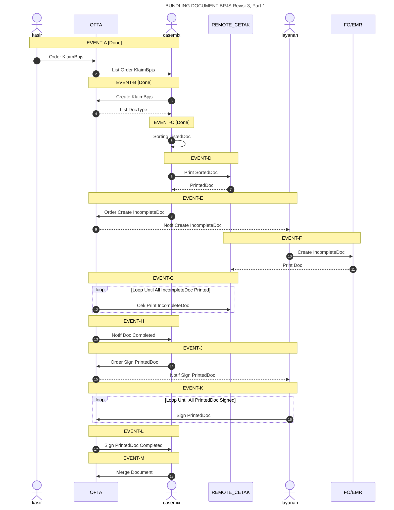

```mermaid
sequenceDiagram
    title BUNDLING DOCUMENT BPJS Revisi-3, Part-1
    actor kasir
    participant OFTA
    actor casemix
    participant REMOTE_CETAK
    actor layanan
    participant FO/EMR
    autonumber 1

    note over kasir, casemix: EVENT-A [Done]
    kasir ->> OFTA: Order KlaimBpjs 
    OFTA -->> casemix: List Order KlaimBpjs 

    note over OFTA, casemix: EVENT-B [Done]
    casemix ->> OFTA: Create KlaimBpjs
    OFTA -->> casemix: List DocType

    note over casemix: EVENT-C [Done]
    casemix ->> casemix: Sorting ListedDoc
    
    note over casemix, REMOTE_CETAK: EVENT-D
    casemix ->> REMOTE_CETAK: Print SortedDoc
    REMOTE_CETAK -->> casemix : PrintedDoc

    note over OFTA, layanan: EVENT-E
    casemix ->> OFTA: Order Create IncompleteDoc 
    OFTA -->> layanan: Notif Create IncompleteDoc
    
    note over REMOTE_CETAK, FO/EMR: EVENT-F
    layanan ->> FO/EMR : Create IncompleteDoc
    FO/EMR -->> REMOTE_CETAK: Print Doc

    note over OFTA, REMOTE_CETAK: EVENT-G
    loop Loop Until All IncompleteDoc Printed
        OFTA ->> REMOTE_CETAK : Cek Print IncompleteDoc
    end
    
    note over OFTA, casemix: EVENT-H
    OFTA ->> casemix : Notif Doc Completed

    note over OFTA, layanan: EVENT-J
    casemix ->> OFTA: Order Sign PrintedDoc
    OFTA -->> layanan: Notif Sign PrintedDoc


    note over OFTA, layanan: EVENT-K
    loop Loop Until All PrintedDoc Signed
        layanan ->> OFTA: Sign PrintedDoc
    end

    note over OFTA, casemix: EVENT-L
    OFTA ->> casemix: Sign PrintedDoc Completed

    note over OFTA, casemix: EVENT-M
    casemix ->> OFTA: Merge Document
```
