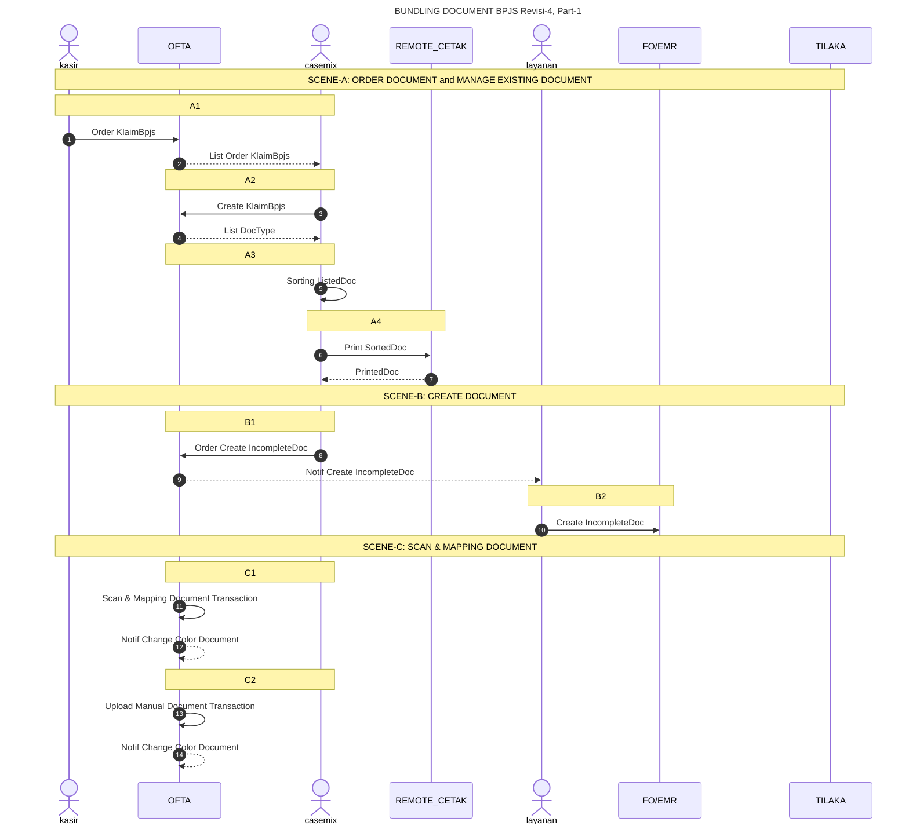
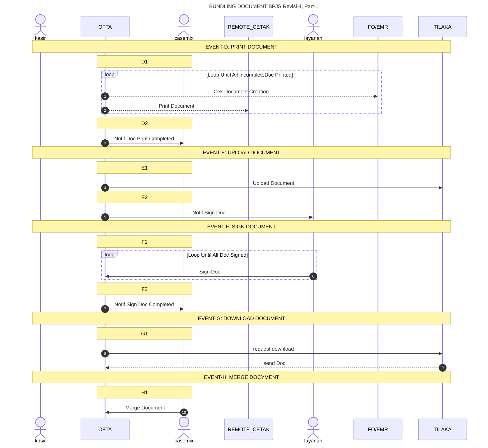

# FLOW DOCUMENT KLAIM BPJS

## PART-1

```mermaid
sequenceDiagram
    title BUNDLING DOCUMENT BPJS Revisi-4, Part-1
    actor kasir
    participant OFTA
    actor casemix
    participant REMOTE_CETAK
    actor layanan
    participant FO/EMR
    participant TILAKA
    autonumber 1

    note over kasir, TILAKA: SCENE-A: ORDER DOCUMENT and MANAGE EXISTING DOCUMENT
    note over kasir, casemix: A1
    kasir ->> OFTA: Order KlaimBpjs 
    OFTA -->> casemix: List Order KlaimBpjs 

    note over OFTA, casemix: A2
    casemix ->> OFTA: Create KlaimBpjs
    OFTA -->> casemix: List DocType

    note over OFTA, casemix: A3
    casemix ->> casemix: Sorting ListedDoc
    
    note over casemix, REMOTE_CETAK: A4
    casemix ->> REMOTE_CETAK: Print SortedDoc
    REMOTE_CETAK -->> casemix : PrintedDoc

    note over kasir, TILAKA: SCENE-B: CREATE DOCUMENT 
    note over OFTA, casemix: B1
    casemix ->> OFTA: Order Create IncompleteDoc 
    OFTA -->> layanan: Notif Create IncompleteDoc
    
    note over layanan, FO/EMR: B2
    layanan ->> FO/EMR : Create IncompleteDoc

    note over kasir, TILAKA: SCENE-C: SCAN & MAPPING DOCUMENT 
    note over OFTA, casemix: C1
    OFTA ->> OFTA: Scan & Mapping Document Transaction
    OFTA -->> OFTA: Notif Change Color Document

    note over OFTA, casemix: C2
    OFTA ->> OFTA: Upload Manual Document Transaction
    OFTA -->> OFTA: Notif Change Color Document
```

## PART-2

```mermaid
sequenceDiagram
    title BUNDLING DOCUMENT BPJS Revisi-4, Part-1
    actor kasir
    participant OFTA
    actor casemix
    participant REMOTE_CETAK
    actor layanan
    participant FO/EMR
    participant TILAKA
    autonumber 1

    note over kasir, TILAKA: EVENT-D: PRINT DOCUMENT
    note over OFTA, casemix: D1
    loop Loop Until All IncompleteDoc Printed
        OFTA -->> FO/EMR: Cek Document Creation
        OFTA -->> REMOTE_CETAK: Print Document
    end
    note over OFTA, casemix: D2
    OFTA ->> casemix : Notif Doc Print Completed
    
    note over kasir, TILAKA: EVENT-E: UPLOAD DOCUMENT
    note over OFTA, casemix: E1
    OFTA ->> TILAKA : Upload Document
    note over OFTA, casemix: E2
    OFTA ->> layanan: Notif Sign Doc

    note over kasir, TILAKA: EVENT-F: SIGN DOCUMENT
    note over OFTA, casemix: F1
    loop Loop Until All Doc Signed
        layanan ->> OFTA: Sign Doc
    end
    note over OFTA, casemix: F2
    OFTA ->> casemix: Notif Sign Doc Completed

    note over kasir, TILAKA: EVENT-G: DOWNLOAD DOCUMENT
    note over OFTA, casemix: G1
    OFTA ->> TILAKA: request download
    TILAKA -->> OFTA : send Doc

    note over kasir, TILAKA: EVENT-H: MERGE DOCYMENT
    note over OFTA, casemix: H1
    casemix ->> OFTA: Merge Document
```
