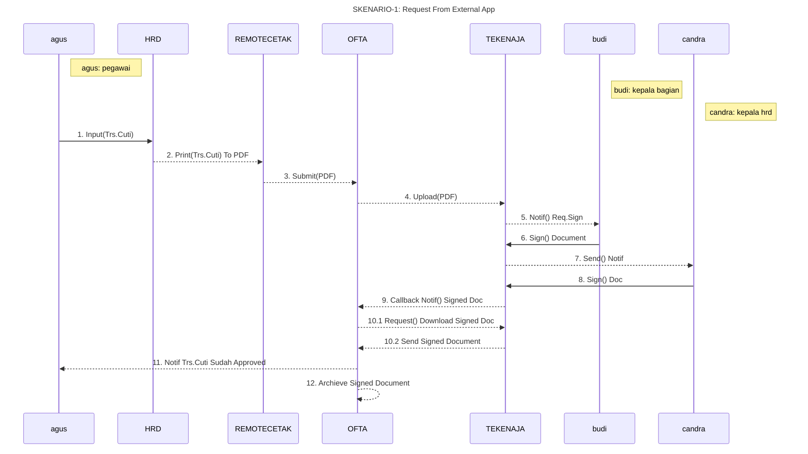
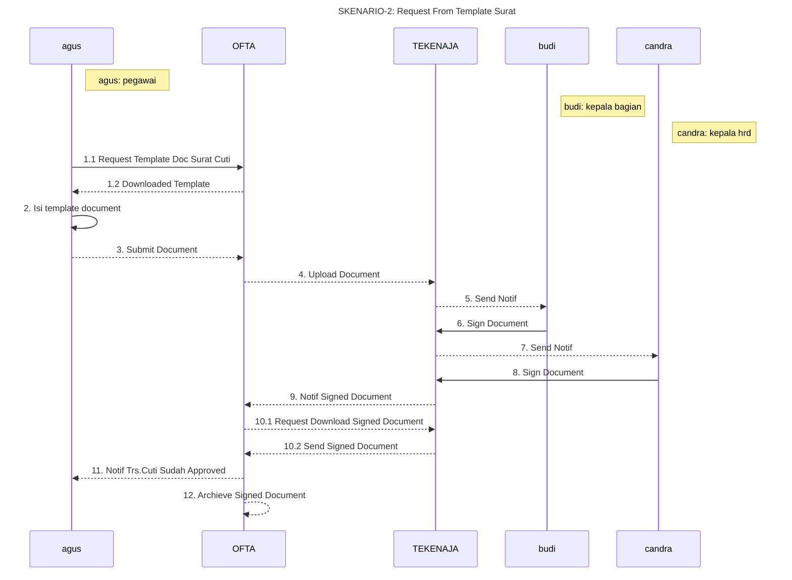
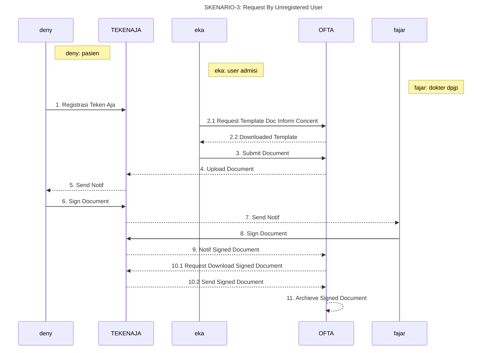
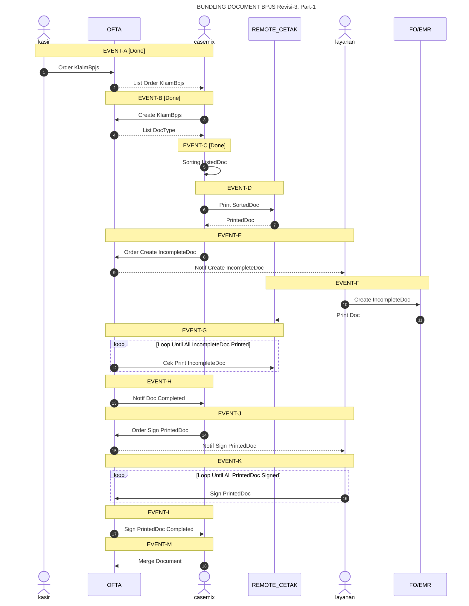
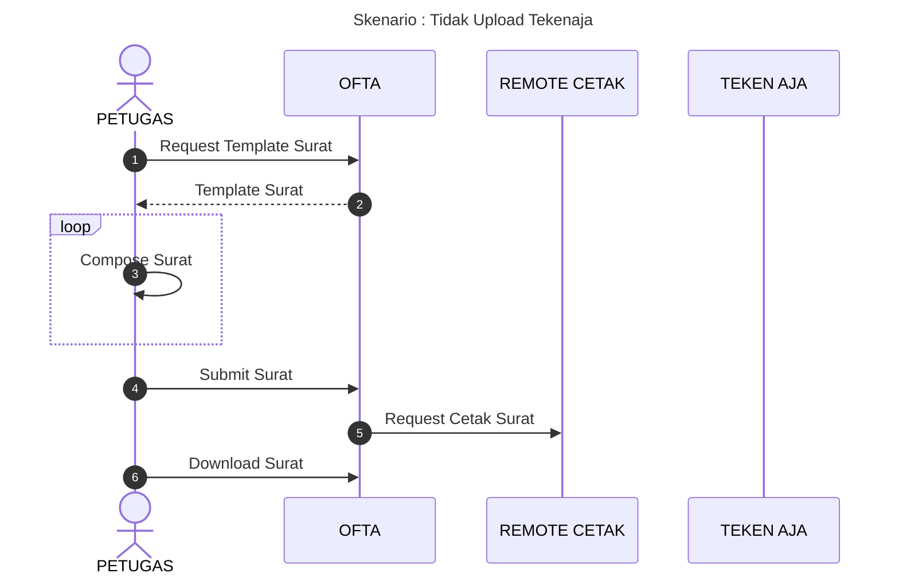

# OFTA (Office Automation) Documentation

1. Deskripsi Produk

   1.1. Goal
   OFTA adalah system software untuk mengubah pencatatan dan penyimpanan dokumen rumah sakit dari menggunakan kertas menjadi dokumen digital.

   1.2. Objective
      1. Memindahkan sistem pencatatan dokumen template dari EMR-1 dan EMR-2 ke OFTA
      2. Menerapkan TTE Tersertifikasi dalam proses Approval Document
      3. Bundling Document untuk lampiran klaim BPJS

3. Specification

   2.2. Use-Case 1. Pegawai membutuhkan approval atas sebuah dokumen - Agus: Pegawai - Budi: Kepala Bagian (Sign-1) - Candra: Kepala HRD (Sign-2)









```
- mapping event => use-case
  - Event-A => CreateOrderKlaimBpjsCommand;
  - Event-B => CreateKlaimBpjsCommand;
  - Event-C => AddDocTypeToKlaimBpjsCommand, RemoveDocTypeFromKlaimBpjsCommand;
  - Event-D => PrintDocKlaimBpjsCommand;
```


